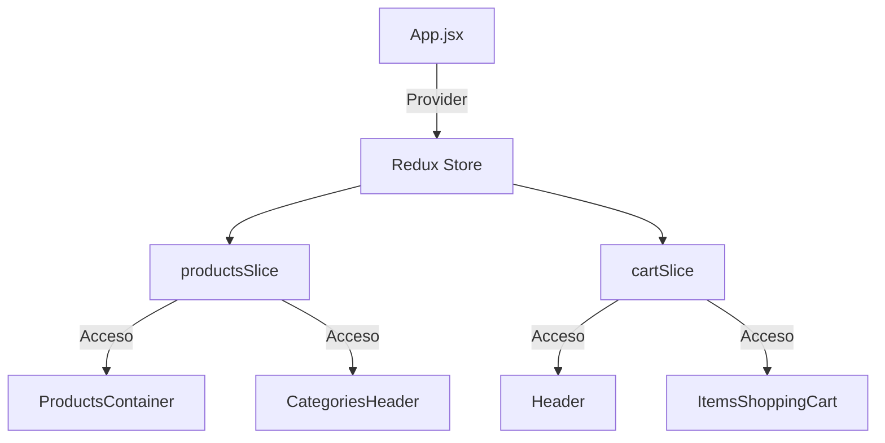
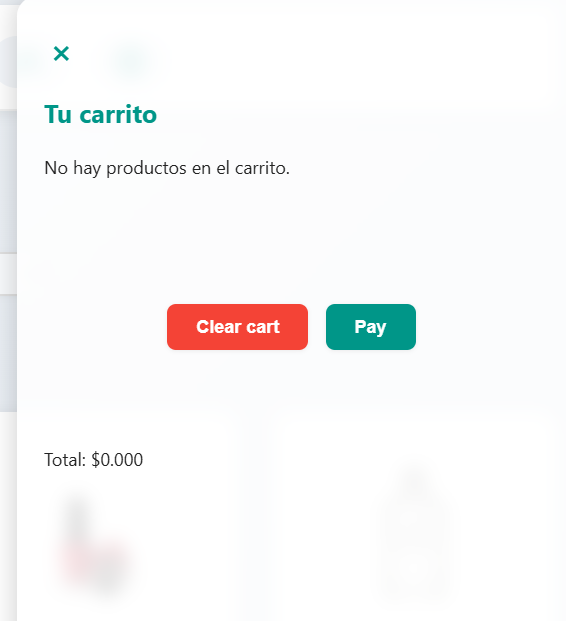
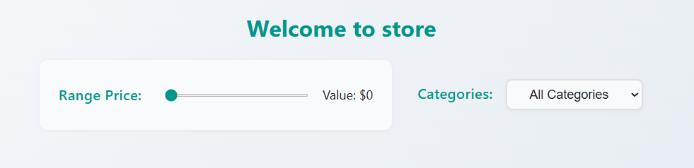
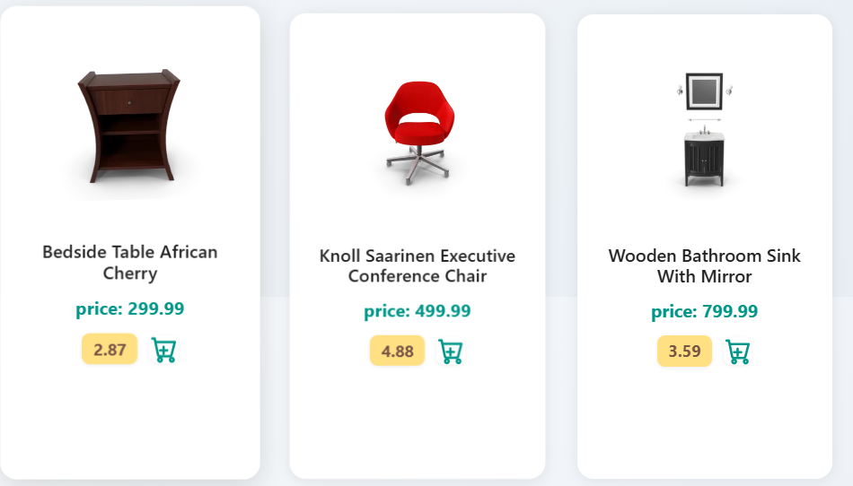

# Ecommerce React App

Este proyecto es una tienda en línea construida con **React**, **Redux Toolkit** y **Vite**.  
A continuación encontrarás una mini documentación de los elementos más importantes, priorizando la arquitectura de contextos (Redux slices) y su funcionalidad.

---

## 🗂️ Estructura Principal

```
src/
│
├── components/         # Componentes reutilizables (Header, ProductsContainer, etc.)
├── contexts/           # Configuración de Redux store
├── slices/             # Redux slices (cartSlice, productsSlice)
└── App.jsx             # Componente principal
```

---

## ⚙️ Contextos (Redux Slices)

### 1. **productsSlice**

- **Responsabilidad:** Maneja el estado global de los productos y categorías.
- **Acciones principales:**
  - `setProducts`: Actualiza la lista de productos filtrados o buscados.
  - `setCategories`: Guarda las categorías disponibles para el filtro.
- **Uso:** Permite que cualquier componente acceda y modifique la lista de productos y categorías desde cualquier parte de la app.

### 2. **cartSlice**

- **Responsabilidad:** Maneja el estado global del carrito de compras.
- **Acciones principales:**
  - `addCart`: Agrega un producto al carrito.
  - `removeCart`: Elimina un producto del carrito.
  - `clearCart`: Vacía el carrito.
- **Uso:** Permite mostrar el carrito, agregar, quitar y limpiar productos desde cualquier componente.

### 3. **configContext.js**

- **Responsabilidad:** Configura el store de Redux y combina los reducers de productos y carrito.
- **Uso:** Se importa en el entry point de la app para proveer el store a todos los componentes.

---

## 🔄 Diagrama Visual de Contextos



---

## 🛠️ Funcionalidades Clave

- **Filtrado de productos:** Por categoría y rango de precio.
- **Búsqueda:** Por nombre de producto.
- **Carrito de compras:** Añadir, quitar y ver productos seleccionados.
- **Persistencia global:** Todos los componentes acceden al estado global mediante Redux.

---

## 🚀 Cómo ejecutar

```bash
npm install
npm run dev
```

---

## 📦 Dependencias principales

- React
- Redux Toolkit
- React Redux
- Vite

---

## 🌐 Proyecto en línea

Puedes ver la aplicación funcionando aquí:  
[https://ecommerce-ucc-project.netlify.app/](https://ecommerce-ucc-project.netlify.app/)

## 🔄 Diagrama Visual de los componentes hechos en la aplicacion 

- Card Component



- Filter Component



- Header Componet


- Item Card



> **Nota:**  Aun no esta completado el projecto , esta enfocado en la parte de estructura de componentes y diseño de componentes, proximamente tendra un backend con todos los modulos de compra gestionados


